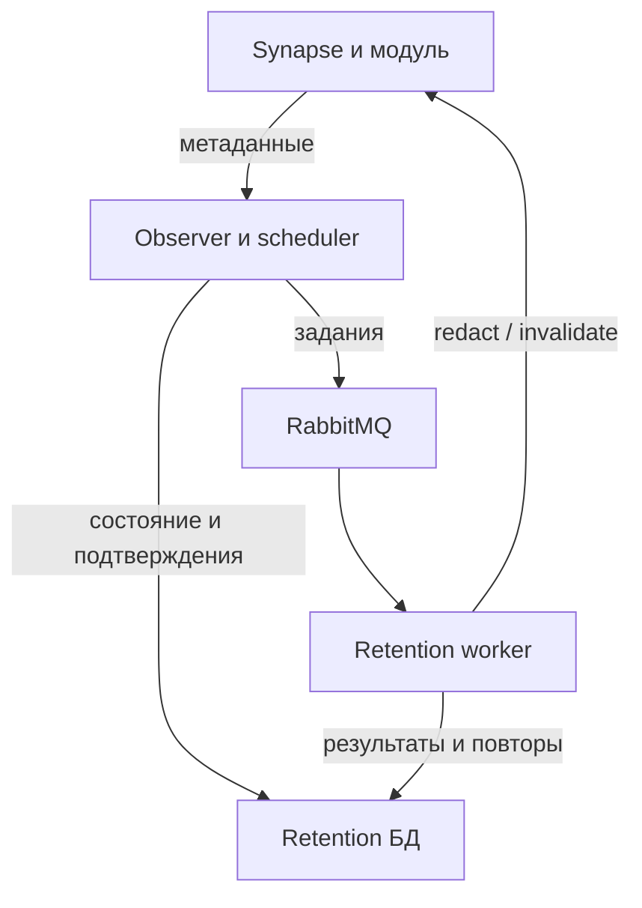

# Архитектура и устройство проекта

## Назначение и границы

Проект дополняет native retention Synapse двумя механизмами: redaction до purge
и обновлением клиентского timeline после физического purge. Приоритет принятого
стенда — итоговое исчезновение сообщений и управляемый рост метаданных.
Точная производительность 100 msg/s и удаление без задержки не гарантируются.
Бот личных команд необязателен и управляет политикой, а не выполняет удаления.

Command-bot подключается отдельно к Matrix client API и делегированным bot API
модуля. Он не подключён к RabbitMQ и retention-БД. Synapse также не находится
в изолированной сети брокера. Модуль работает внутри homeserver, использует
его main datastore, event creation handler, notifier и distributed locks.

## Карта компонентов

| Файл | Ответственность |
| --- | --- |
| src/synapse_retention/module.py | Feed, policy, redaction, purge check, поколения invalidation, очередь reset, Sliding Sync hooks, внутренние endpoints |
| src/synapse_retention/commands.py | Аутентификация обычного бота, проверка личного чата/события/прав, разрешение комнаты, применение политики |
| src/retentionbot/service.py | Bootstrap и поток observer, обновление политик, scheduler, согласованная compaction |
| src/retentionbot/store.py | Метаданные событий/заданий, cursor, lease, deadlines, terminal состояния |
| src/retentionbot/database.py | Фасад параметризованного SQL для PostgreSQL и SQLite |
| src/retentionbot/worker.py | Обработка redact/invalidate, подтверждение результата, backoff, ack/nack |
| src/retentionbot/broker.py | Durable quorum queues, publisher confirms, persistent сообщения, prefetch=1 |
| src/retentionbot/api.py | HTTP clients; module secret и Matrix-token клиенты используют разные полномочия |
| src/retentionbot/invalidation_cleanup.py | Валидация старых подтверждений и транзакционная очистка строк Synapse |
| src/retentionbot/policy.py | Разбор сроков и ограничения политики |
| src/retentionbot/cache_reset.py | Генерационный sentinel с сохранением настоящих ignored users |
| src/retentionbot/command_bot.py | Matrix-nio E2EE, личные диалоги, sync/backfill, BotStore/outbox |
| src/retentionbot/bot_messages.py | Обычный текст и экранированный Matrix HTML, склонение сроков |
| src/retentionbot/room_reference.py | Разбор ID, alias, matrix.to и matrix URI |
| src/retentionbot/cli.py | Observer/worker/command-bot и операторские команды/status/health |
| deploy/patch-synapse-sliding-sync.py | Подключение хуков обновления timeline в Synapse |
| deploy/patch-synapse-room-limiter.py | Покрытие event creation существующим per-room limiter вместе с purge read lock |

## Поток удаления

1. При первом bootstrap observer получает committed stream ceiling и текущее
   время. В своей БД сохраняет cursor/since_ts; модуль использует постоянный cutoff.
   История до начала учёта не превращается в очередь задним числом.
2. Feed читает events по stream_ordering до безопасного ceiling; возвращает только
   ID, room, sender, timestamp, type и anchor timestamp. Политику m.room.retention
   observer использует для обновления комнаты, не как цель удаления.
3. Поддержанные non-state типы: m.room.message, m.room.encrypted, m.reaction,
   m.sticker. Plain edits/reactions используют timestamp родителя как anchor,
   если связь доступна. Содержимое E2EE не расшифровывается службой удаления.
4. Ingest атомарно сохраняет события и позицию потока. Scheduler выбирает pending,
   учитывая anchor, минимум, актуальную политику, next_try и lease. Claim ставится
   до publish; потеря публикации восстанавливается истечением lease (пять минут).
5. Worker получает ID, повторно читает локальное задание, вызывает redact API.
   Модуль снова проверяет политику и срок. Для локального автора использует его
   identity; при необходимости — существующего локального модератора. Вступление
   служебного пользователя в целевую комнату не требуется.
6. Redaction создаётся штатным event creation handler на текущем DAG. Historical
   prev_event_ids используется только после 403 для departed local author;
   возможен последующий fallback на модератора. Принудительная историческая ветка
   для каждого события ранее вызывала квадратичное разрастание history.
7. Worker сохраняет done/missed или повтор. Уже purged событие — missed с
   EVENT_PURGED, а не подтверждённая redaction. Done и missed создают invalidation.
8. После максимального срока worker вызывает invalidate. Модуль проверяет events
   напрямую: кэш Synapse недостаточен для подтверждения физической очистки.
   EVENT_NOT_PURGED откладывает попытку; после purge увеличивается generation комнаты.
9. Invalidation сохраняет event-id идемпотентность, затем отдельно ставит reset
   generation в очередь. Повтор запроса ремонтирует очередь после сбоя между шагами.

## Клиентский кэш

Sliding Sync limited timeline — fallback для открытых комнат; этого недостаточно
для persistent EventCache закрытого чата. При включённом element_x_cache_reset
модуль агрегирует комнаты по debounce и пользователей по min_interval. Distributed
lock сериализует drain; generation/expanded_generation и generation/reset_generation
разделяют постановку и выполнение. Последующее account-data изменение
m.ignored_user_list с зарезервированным генерационным sentinel вызывает reset
на проверенном Element X. Реальные ignored users сохраняются; sentinel должен
быть локальным незарегистрированным ID.

Доступен пользователь после reconnect — значит требуется доставка последнего
состояния, а не всех промежуточных импульсов. Именно поэтому поколения остаются
постоянными после очистки per-event записей. Это workaround клиента, не native
протокол удаления любых кэшей. Не заменять его одним limited=true без новой приёмки.

## Состояния и таблицы

| Хранилище | Таблица | Назначение и срок |
| --- | --- | --- |
| Retention PostgreSQL, schema server | settings | Cursor, since_ts, last_poll_at, scheduler cursor; сохраняются |
| То же | rooms | Эффективная политика и ошибка; сохраняется |
| То же | events | Метаданные, pending/done/missed/blocked, lease/retries, completed_at; terminal очищается после окна |
| То же | invalidations | Pending/done, generation, retries, completed_at; FK cascade от events |
| Synapse main DB | retentionbot_event_invalidations | Event-id → room/generation; согласованная очистка через observer |
| То же | retentionbot_room_invalidations | Постоянное поколение комнаты |
| То же | retentionbot_client_invalidations | Поколение устройства/комнаты и force_until для limited fallback |
| То же | retentionbot_cache_reset_rooms | Generation/expanded_generation/due_ts, durable очередь комнат |
| То же | retentionbot_cache_reset_users | Generation/reset_generation/due_ts/last_reset_ts, durable очередь пользователей |
| Command-bot SQLite, /data | meta/dialogs/replies | Sync metadata, выбор по DM/actor, JSON outbox и sent marker; отдельный lifecycle |
| Command-bot /data | Crypto store и ключ | Matrix-nio E2EE; должны переживать пересоздание контейнера |

Не путать Synapse events и server.events в retention-БД. Первая содержит Matrix
историю, вторая только метаданные внешней службы. stream_ordering_to_exterm —
штатный исторический кэш Synapse, не таблица модуля: около 30 суток и отдельная
очистка. Семидневная compaction не уменьшает его окно.

Порядок terminal compaction описан в [отдельном документе](metadata-compaction.md).
Нет бесконечной дедупликации после удаления tombstones. Worker штатно отсекает
позднюю broker delivery по отсутствующему заданию. Старый восстановленный бэкап
может вызвать дополнительный reset. Orphan записи без surviving completion не
очищаются автоматически. BotStore replies не входят в event compaction;
не утверждать, что все таблицы проекта имеют единый срок хранения.

## API и полномочия

Все пути имеют префикс /_synapse/retention/v1; методы/схемы проверять по исходникам.

| Пути | Доступ | Назначение |
| --- | --- | --- |
| GET /internal/feed, /internal/policy | Module secret | Метаданные и политика |
| POST /internal/redact, /internal/invalidate | Module secret | Работа внешнего worker |
| POST /internal/compact-invalidations | Module secret | Receipts: event_id, room_id, generation, completed_at; 1..1000, старше семи суток |
| POST /command | Matrix user token | Прямая операторская команда с проверкой прав |
| POST /bot/info, /bot/invite, /bot/context, /bot/chat, /bot/resolve, /bot/command | Токен настроенного обычного бота | Управление через проверенное личное событие |

BotStore хранит структурированный ответ JSON для идемпотентности. Только перед
отправкой reply_content создаёт m.notice с plain body и org.matrix.custom.html.
JSON outbox не является форматом пользовательского интерфейса. HTML всегда
экранировать; Matrix txn_id детерминирован по исходному event_id. Рестарт не должен
повторно применять уже выполненную команду поверх более поздней политики.

## Ошибки и восстановление

Retryable API/network failures сохраняют pending с backoff до пяти минут.
NO_LOCAL_MODERATOR остаётся ожидающим заданием с явной причиной. Malformed broker
job отклоняется в dead queue; неожиданные ошибки дают nack/requeue. Quorum queue
на одном RabbitMQ узле даёт persistence, не HA. Состояние работы — в БД, очередь
не является единственным источником истины. При изменении recovery протокола
проверять lost publish, lost HTTP response, restart, replay и согласование cutoff.
